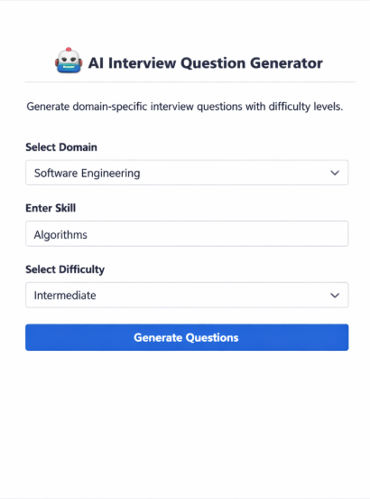
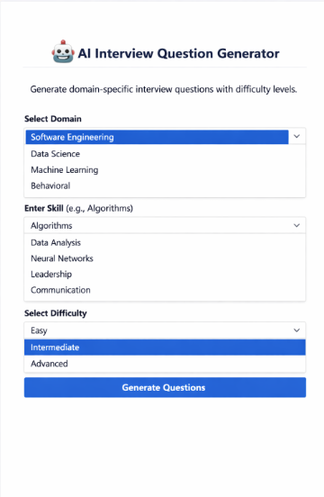
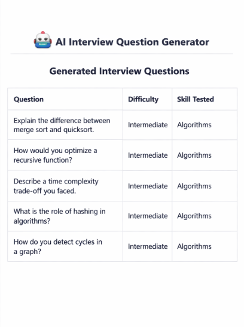

# AI Interview Question Generator

AI Interview Question Generator using streamlit and OpenAI.  

## Features
- Choose domain (Software, Data Science, ML, Behavioral)
- Select difficulty (Beginner, Intermediate, Advanced)
- Enter skill focus
- Generates 5 interview questions in a clean table format

## How to Run
1. Clone this repo
2. Install dependencies: `pip install -r requirements.txt`
3. Set your API key: `export OPENAI_API_KEY="your_api_key_here"`
4. Run: `streamlit run app.py`

## Demo Screenshot

---
